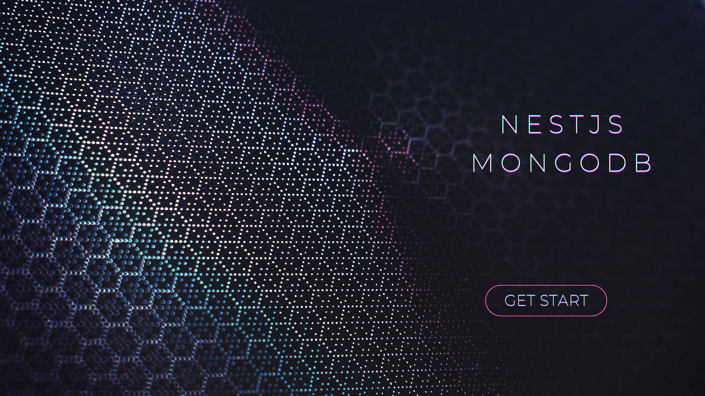

  <p align="center">Configuração inicial de NestJS e MongoDB com dois exemplos de schemas.</p>
    <p align="center">

## Descrição

Repositório para servir de template e/ou estudos iniciais de NestJS e MongoDB, possui dois exemplos de schemas, com relacionamentos e arrays de entidades relacionadas, problema comum em relacionamentos em bancos NoSQL

## Installation

```bash
$ npm install
```

## Running the app

```bash
# development
$ npm run start

# watch mode
$ npm run start:dev

# production mode
$ npm run start:prod
```


## Contato
Com intuito de disceminar o conhecimento, caso utilize este repositório para estudos ou inicial um projeto, por favor, deixe a estrelinha, caso tenha alguma dificuldade pode entrar em contato comigo que estou sempre disponível para uma boa prosa

- Author - [Vitor dos Santos Pedra](https://www.linkedin.com/in/vspedra/)
- Website - [Portfólio](https://vspedra.netlify.app)
